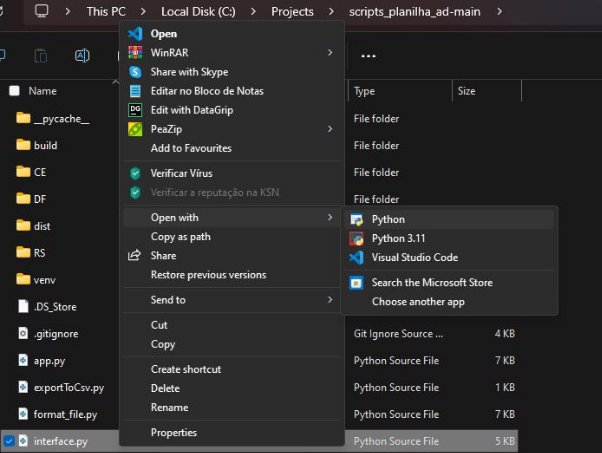
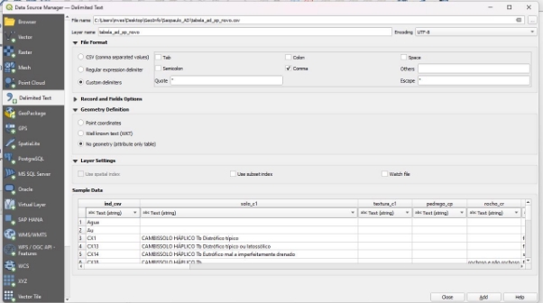
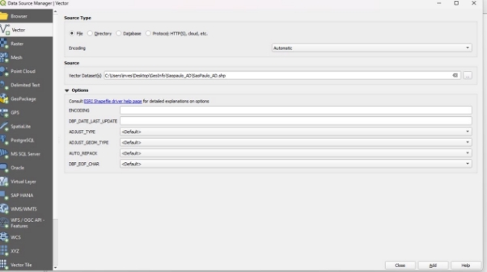
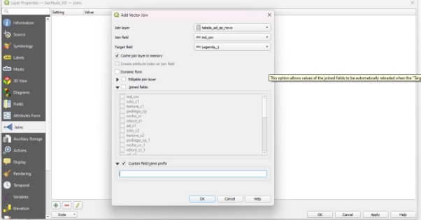

Estevão Lucas Ramos da Silva   hurryblank@gmail.com 

**Protocolo inserção e padronização de mapas** 

Em busca de uma padronização referente aos dados e mapas de Água Disponível no solo, fruto dos zoneamentos do solos e se baseando no[ boletim de pesquisa e desenvolvimento 282 - (Avaliação, Predição e Mapeamento de Água Disponível em Solos do Brasil).](https://ainfo.cnptia.embrapa.br/digital/bitstream/item/243230/1/CNPS-BPD-282-2022.pdf) Houve a necessidade da criação deste documento. A demanda da aplicação **ADBrasil** sobre informações do componente fez que os mapas fornecessem informações mais detalhadas da Unidade de Mapeamento – UM. São essas informações: 

|**Padrão nomenclatura** |**Significado** |
| - | - |
|ind\_csv** |Índice  utilizado  para  relacionar informações  com  os  vetores  do  mapa. Obs.: Esse índice poderá mudar de acordo com  cada  planilha  cabe  o  analista observar a coluna capaz de dar Join em ambiente SIG. |
|c1\_class |Nome  do  solo  até  o  quarto  nível hierárquico mais a sigla do solo. Separado pelo traço ‘-‘. |
|solo\_c1 |` `Nome  do  solo  até  o  quarto  nível hierárquico do primeiro componente. |
|textura\_c1 |Textura do primeiro componente o solo com  maior  representatividade.  Obs.:  A textura  geralmente  se  encontra  dividida em até 3 colunas, a informação deve ser aglutinada. |
|pedrego\_c1 |Pedregosidade do primeiro componente. |
|rocho\_c1 |Rochosidade do primeiro componente. |
|relevo\_c1 |Relevo do primeiro componente. |

|ad\_c1  ||Água  disponível  do  primeiro componente. |
| - | :- | :- |
|solo\_c2 ||Nome  do  solo  até  o  quarto  nível hierárquico do segundo componente. |
|||Textura do segundo componente. Obs.: A |
|textura\_c2 ||textura  geralmente  se  encontra  dividida em até 3 colunas, a informação deve ser |
|||aglutinada. |
|pedrego\_c2 ||Pedregosidade do segundo componente. |
|rocho\_c2 ||Rochosidade do segundo componente. |
|relevo\_c2 ||Relevo do segundo componente. |
|ad\_c2  ||Água disponível do segundo componente. |
|solo\_c3 ||Nome  do  solo  até  o  quarto  nível hierárquico do terceiro componente. |
|||Textura  do  terceiro  componente  o  solo |
|||com  maior  representatividade.  Obs.:  A |
|textura\_c3 ||textura  geralmente  se  encontra  dividida |
|||em até 3 colunas, a informação deve ser |
|||aglutinada. |
|pedre\_c3 ||Pedregosidade do Terceiro componente. |
|rocho\_c3 ||Rochosidade do terceiro componente. |
|relevo\_c3 ||Relevo do terceiro componente. |
|ad\_c3  ||Água disponível do terceiro componente. |
|solo\_c4 ||Nome  do  solo  até  o  quarto  nível hierárquico do quarto componente. |
||||
|||Textura do quarto componente o solo com |
|||maior representatividade. Obs.: A textura |
|textura\_c4 ||geralmente se encontra dividida em até 3 |
|||colunas,  a  informação  deve  ser |
|||aglutinada. |
|pedrego\_c4 ||Pedregosidade do quarto componente. |
|rocho\_c4 ||Rochosidade do quarto componente. |

|relevo\_c4 ||Relevo do quarto componente. |
| - | :- | - |
|ad\_c4  ||Água disponível do quarto componente. |
|solo\_c5 ||Nome  do  solo  até  o  quarto  nível hierárquico do quinto componente. |
|||Textura do quinto componente o solo com |
|||maior representatividade. Obs.: A textura |
|textura\_c5 ||geralmente se encontra dividida em até 3 |
|||colunas,  a  informação  deve  ser |
|||aglutinada. |
|pedrego\_c5 ||Pedregosidade do quinto componente. |
|rocho\_c5 ||Rochosidade do quinto componente. |
|relevo\_c5 ||Relevo do quinto componente. |
|ad\_c5  ||Água disponível do quinto componente. |
|ad\_um ||Água  disponível  da  unidade  de mapeamento. |

Este padrão foi desenvolvido através das planilhas utilizadas no fomento do boletim de pesquisa 282, que por sua vez foram advindos das planilhas desenvolvidas nos zoneamentos pedoclimáticos realizados. Para automatizar esse processo foi criado um script em Python com interface gráfica afim de facilitar o uso da aplicação. Para que todo o processo seja realizado deve-se impreterivelmente seguir as 3 etapas. 

**Etapa  1  -**  Garantir  que  a  planilha  segue  o  formato  e  extensão  da  *tabela\_ad.xlsx*  ou *tabela\_ad.csv.* **Observe a tabela modelo na pasta deste documento.** 

**Etapa 2 –** Garantir que a planilha esteja com somente uma aba. 

**Etapa 3 –** Garantir que as informações contenham um índice capaz de relacionar com os vetores. 

**Tutorial de utilização do script** 

Baixe a pasta do projeto neste link[ https://github.com/luccve/scripts_planilha_ad ](https://github.com/luccve/scripts_planilha_ad) 

Para ser utilizado o script é preciso ter o interpretador Python instalado a versão mínima é o Python 3.9. Existe um arquivo chamado *interface.exe* que irá rodar o programa de forma mais simples, no entanto a inicialização dele é demorado devido a falta de certificado digital da aplicação. Alguns antivírus por padrão bloqueia o uso do programa sem certificações.  

Para resolver isso ou desative o seu antivírus ou execute o arquivo Python *interface.py*. Mas antes observe em criar o ambiente virtual do Python, para isso foi disponibilizado um script **é só executar o arquivo *inicializar.bat* da pasta do projeto. No Linux/Mac execute o *inicilizador.sh***.  Sem  esse  ambiente  virtual  a  execução  não  será  realizada  uma  vez  que  a linguagem precisa de algumas bibliotecas para funcionar. Para visualizar as bibliotecas observe o arquivo *requirements.txt*. 

Para executar via interpretador abra o arquivo com o programa Python ou qualquer IDE 

e execute. 

No interpretador padrão Python aperte em ‘Run’ e depois ‘Run Module’ ou apenas 

aperte ‘F5’. 

**A interface** 

Há apenas quatro interações que o usuário pode fazer: para selecionar o arquivo, o valor de target e escolher ou escrever o valor da escala e o comando de executar o script. 

**Arquivo de entrada** 

Se atente para o padrão já supracitado neste documento, e evitar usos de espaços, pontos, caracteres especiais e caracteres latinos no nome do arquivo ou diretório no qual ele estar. 

**"C:\Projects\pasta de exemplo. errada\arquivo de exemplo. errado @.xlsx" "C:\Projects\pastadeexemplocerto\arquivodeexemplocerto.xlsx"** 

**O valor do target** 

Como descrito o campo: *Selecione o target* é responsável por escolher a coluna que será relacionado com as informações do mapa, portanto é preciso reconhecer qual coluna tem essas características com o mapa. 

**O valor da escala** 

Como estratégia para reconhecer automaticamente as escalas no mapa na aplicação que requer essas informações, foi adicionada uma coluna correspondente. Se a escala não for especificada, por padrão, será assumida a escala de 1:250.000. No entanto, ao digitar uma escala específica, lembre-se de inserir apenas o valor da escala neste formato: por exemplo, ‘100.000’ em vez de ‘100000’. 

**Padrão de saída** 

Por padrão a extensão do arquivo de saída será ‘*.csv’* e o nome será seguido com o nome atual do arquivo seguido pelo prefixo ‘*\_novo’.* Ele será salvo dentro da pasta do arquivo selecionado. 

**Join dos índices com os vetores espaciais utilizando QGIS** 

Adicione o ‘*.csv’* arquivo delimitado por virgula no QGIS, se atente ao encoding UTF-8 para garantir que caráteres latinos sejam visualizados. 

Adicione o arquivo correspondente ao mapa de AD. 

Clique nas propriedades da camada do mapa adicionada e faça o JOIN. 

Observe que por padrão o QGIS cria um prefixo nas colunas, marque a opção de personalizar o campo do prefixo e deixe em branco. Observe que o campo que irá fazer o Join deve ser igual ao ‘*ind\_csv’*,* neste caso o campo *Legenda\_1* do mapa que foi adicionado é o responsável pelo endereçamento das informações 

**Salvar o arquivo** 

Por padrão o arquivo nomeado deverá ser salvo em ‘*.gpkg’* ou *‘.shp’*¸o nome do arquivo deverá ser salvo pela localização do arquivo seguido pela escala e finalizado pela sigla ‘*AD*’. **Ex.: SP\_100000\_AD.gpkg** 

**GeoInfo** 

A partir de agora siga o tutorial proposto por Ricardo Dart para fazer upload de mapas no site do[ https://geoinfo.dados.embrapa.br/. ](https://geoinfo.dados.embrapa.br/)

Os mapas de AD devem seguir uma legenda oficial o arquivo disponibilizado para isso é o ‘*estilo\_ad.sld’.* 

**Mudanças e alterações** 

Se  caso  haja  necessidade  de  adaptação  do  script,  acesse  o  repositório  público. [https://github.com/luccve/scripts_planilha_ad ](https://github.com/luccve/scripts_planilha_ad)e faça um fork do projeto. 
